# RebelCODE Completion Roadmap

## Final Goal Definition

RebelCODE is an AI-powered coding environment for the RebelSUITE ecosystem. Its final goal is to provide a comprehensive development experience with a Monaco-based IDE, integrated debugging and profiling tools, AI-powered code assistance, and seamless integration with other RebelSUITE components.

### Key Capabilities at Completion

- Monaco-based code editor with advanced features
- Multi-language support (TypeScript, JavaScript, Python, C++, Lua)
- Integrated debugging and profiling tools
- AI-powered code completion and error detection
- Blueprint visual scripting system
- Version control integration
- Plugin system for extensibility
- Seamless integration with all RebelSUITE components

## Current Status Assessment

RebelCODE is in the early stages of development, with focus on establishing the core framework and basic editor functionality. The current overall completion is approximately 6.25%.

### Progress by Category

| Category | Current Completion | Status |
|----------|-------------------|--------|
| Core Framework | 10% | In Progress |
| Monaco Editor Integration | 15% | In Progress |
| Language Support | 5% | In Progress |
| Debugging Tools | 5% | In Progress |
| Profiling Tools | 0% | Not Started |
| AI-Powered Features | 5% | In Progress |
| Blueprint Visual Scripting | 0% | Not Started |
| Version Control Integration | 0% | Not Started |
| Plugin System | 0% | Not Started |
| RebelSUITE Integration | 0% | Not Started |
| User Interface | 10% | In Progress |
| Testing Tools | 0% | Not Started |

### Key Achievements to Date

1. Basic Monaco editor integration with syntax highlighting
2. Initial project management system implementation
3. Basic UI workspace layout and panel system
4. Preliminary TypeScript/JavaScript language support
5. Initial debugging tools with basic breakpoint functionality

### Current Challenges

1. Complexity of Monaco editor integration and customization
2. Resource allocation for parallel development tracks
3. AI feature implementation and performance optimization
4. Integration planning with other RebelSUITE components

## Detailed Completion Roadmap

The development of RebelCODE is organized into four major phases, each with specific milestones and deliverables:

### Phase 1: Foundation (Current Phase - 20% Complete)

**Objective**: Establish the core framework and basic editor functionality

**Timeline**: Q1 2025 - Q2 2025 (6 months)

**Key Deliverables**:

| Deliverable | Status | Target Completion | Dependencies |
|-------------|--------|-------------------|--------------|
| Core framework implementation | In Progress (30%) | Week 12 | None |
| Project management system | In Progress (30%) | Week 14 | Core framework |
| File system integration | In Progress (25%) | Week 10 | Core framework |
| Error handling framework | In Progress (20%) | Week 11 | Core framework |
| Logging system | In Progress (40%) | Week 9 | Core framework |
| Configuration management | In Progress (15%) | Week 13 | Core framework |
| Basic Monaco editor integration | In Progress (50%) | Week 8 | Core framework |
| Syntax highlighting | In Progress (40%) | Week 10 | Monaco editor |
| Code completion | In Progress (20%) | Week 16 | Monaco editor |
| Error highlighting | In Progress (15%) | Week 18 | Monaco editor |
| Basic TypeScript/JavaScript support | In Progress (20%) | Week 14 | Monaco editor |
| Basic Python support | In Progress (15%) | Week 20 | Monaco editor |
| Basic debugging tools | In Progress (15%) | Week 22 | Core framework |
| UI workspace layout | In Progress (30%) | Week 12 | Core framework |
| Panel system | In Progress (25%) | Week 14 | UI workspace |
| Tab management | In Progress (20%) | Week 16 | Panel system |
| File explorer | In Progress (15%) | Week 18 | File system integration |

**Milestones**:
- M1.1: Core Framework Alpha (Week 12)
- M1.2: Basic Editor Functionality (Week 16)
- M1.3: Initial Language Support (Week 20)
- M1.4: Phase 1 Complete / Alpha Release Readiness (Week 24)

**Current Focus**:
- Complete core framework implementation
- Enhance Monaco editor integration
- Improve TypeScript/JavaScript language support
- Expand basic debugging capabilities
- Enhance UI workspace and panels

### Phase 2: Core Functionality (0% Complete)

**Objective**: Implement essential coding and debugging features

**Timeline**: Q2 2025 - Q3 2025 (6 months)

**Key Deliverables**:

| Deliverable | Status | Target Completion | Dependencies |
|-------------|--------|-------------------|--------------|
| Complete Monaco editor integration | Not Started (0%) | Week 28 | Basic Monaco integration |
| Advanced code completion | Not Started (0%) | Week 30 | Basic code completion |
| Multi-cursor editing | Not Started (0%) | Week 32 | Monaco editor |
| Find and replace | Not Started (0%) | Week 34 | Monaco editor |
| Code navigation | Not Started (0%) | Week 36 | Monaco editor |
| Complete TypeScript/JavaScript support | Not Started (0%) | Week 30 | Basic language support |
| Enhanced Python support | Not Started (0%) | Week 32 | Basic Python support |
| C++ support | Not Started (0%) | Week 36 | Language support framework |
| Lua support | Not Started (0%) | Week 40 | Language support framework |
| Advanced debugging tools | Not Started (0%) | Week 38 | Basic debugging tools |
| Call stack navigation | Not Started (0%) | Week 40 | Basic debugging tools |
| Watch expressions | Not Started (0%) | Week 42 | Basic debugging tools |
| Initial profiling capabilities | Not Started (0%) | Week 44 | Core framework |
| Basic AI code completion | Not Started (0%) | Week 46 | Code completion |
| Basic version control integration | Not Started (0%) | Week 48 | File system integration |

**Milestones**:
- M2.1: Advanced Editor Features (Week 32)
- M2.2: Comprehensive Language Support (Week 40)
- M2.3: Complete Debugging Tools (Week 44)
- M2.4: Phase 2 Complete / Beta Release Readiness (Week 48)

**Planned Focus**:
- Complete Monaco editor integration with all advanced features
- Implement comprehensive language support for multiple languages
- Develop full debugging toolset with advanced capabilities
- Begin profiling tools implementation
- Implement basic AI-powered features
- Start version control integration

### Phase 3: Advanced Features (0% Complete)

**Objective**: Implement advanced features and RebelSUITE integration

**Timeline**: Q3 2025 - Q4 2025 (6 months)

**Key Deliverables**:

| Deliverable | Status | Target Completion | Dependencies |
|-------------|--------|-------------------|--------------|
| Advanced AI code completion | Not Started (0%) | Week 52 | Basic AI code completion |
| AI error detection | Not Started (0%) | Week 54 | Basic AI features |
| Code refactoring suggestions | Not Started (0%) | Week 56 | AI code completion |
| Documentation generation | Not Started (0%) | Week 58 | AI features |
| Blueprint visual scripting canvas | Not Started (0%) | Week 60 | Core framework |
| Node library | Not Started (0%) | Week 62 | Blueprint canvas |
| Connection system | Not Started (0%) | Week 64 | Blueprint canvas |
| Visual debugging | Not Started (0%) | Week 66 | Blueprint canvas, Debugging tools |
| Complete profiling tools | Not Started (0%) | Week 68 | Initial profiling |
| Memory profiling | Not Started (0%) | Week 70 | Profiling tools |
| Plugin system architecture | Not Started (0%) | Week 72 | Core framework |
| Plugin API | Not Started (0%) | Week 74 | Plugin architecture |
| Initial RebelCAD integration | Not Started (0%) | Week 76 | Core framework |
| Initial RebelENGINE integration | Not Started (0%) | Week 78 | Core framework |
| Initial RebelFLOW integration | Not Started (0%) | Week 80 | Core framework |

**Milestones**:
- M3.1: Advanced AI Features (Week 58)
- M3.2: Blueprint Visual Scripting (Week 66)
- M3.3: Complete Profiling Tools (Week 70)
- M3.4: Phase 3 Complete / Release Candidate Readiness (Week 80)

**Planned Focus**:
- Implement advanced AI-powered features
- Develop blueprint visual scripting system
- Complete profiling tools implementation
- Create plugin system architecture
- Begin RebelSUITE component integration
- Enhance user interface with advanced customization

### Phase 4: Refinement & Release (0% Complete)

**Objective**: Finalize all features, optimize performance, and prepare for release

**Timeline**: Q4 2025 - Q1 2026 (6 months)

**Key Deliverables**:

| Deliverable | Status | Target Completion | Dependencies |
|-------------|--------|-------------------|--------------|
| Complete RebelSUITE integration | Not Started (0%) | Week 84 | Initial integration |
| Performance optimization | Not Started (0%) | Week 88 | All core features |
| Memory usage optimization | Not Started (0%) | Week 90 | Performance optimization |
| Startup time optimization | Not Started (0%) | Week 92 | Performance optimization |
| Comprehensive testing | Not Started (0%) | Week 94 | All features |
| Documentation completion | Not Started (0%) | Week 96 | All features |
| Final UI polish | Not Started (0%) | Week 98 | UI components |
| Cross-platform testing | Not Started (0%) | Week 100 | All features |
| User acceptance testing | Not Started (0%) | Week 102 | All features |
| Final bug fixing | Not Started (0%) | Week 104 | Testing |
| Release preparation | Not Started (0%) | Week 106 | All deliverables |
| Final release | Not Started (0%) | Week 108 | Release preparation |

**Milestones**:
- M4.1: Complete RebelSUITE Integration (Week 84)
- M4.2: Performance Optimization (Week 92)
- M4.3: Testing and Documentation (Week 100)
- M4.4: Final Release (Week 108)

**Planned Focus**:
- Complete integration with all RebelSUITE components
- Optimize performance and resource usage
- Conduct comprehensive testing
- Complete documentation
- Polish user interface
- Prepare for final release

## Implementation Priority List

The following priorities guide the implementation sequence:

### Critical Path Items

1. Core framework implementation
2. Monaco editor integration
3. Language support for primary languages
4. Debugging tools
5. AI-powered features
6. Blueprint visual scripting
7. RebelSUITE integration
8. Performance optimization
9. Testing and documentation
10. Final release preparation

### Dependencies

```mermaid
graph TD
    A[Core Framework] --> B[Project Management]
    A --> C[File System Integration]
    A --> D[Error Handling]
    A --> E[Logging System]
    A --> F[Configuration Management]
    A --> G[Monaco Editor Integration]
    G --> H[Syntax Highlighting]
    G --> I[Code Completion]
    G --> J[Error Highlighting]
    G --> K[Code Folding]
    G --> L[Multi-cursor Editing]
    G --> M[Find and Replace]
    G --> N[Code Navigation]
    G --> O[Language Support]
    O --> P[TypeScript/JavaScript]
    O --> Q[Python]
    O --> R[C++]
    O --> S[Lua]
    A --> T[Debugging Tools]
    T --> U[Breakpoint Management]
    T --> V[Variable Inspection]
    T --> W[Call Stack Navigation]
    T --> X[Watch Expressions]
    T --> Y[Step Execution]
    A --> Z[Profiling Tools]
    Z --> AA[CPU Profiling]
    Z --> AB[Memory Profiling]
    Z --> AC[Performance Timeline]
    I --> AD[AI Code Completion]
    J --> AE[AI Error Detection]
    AD --> AF[Code Refactoring Suggestions]
    AD --> AG[Documentation Generation]
    A --> AH[Blueprint Visual Scripting]
    AH --> AI[Node Library]
    AH --> AJ[Connection System]
    AH --> AK[Visual Debugging]
    T --> AK
    A --> AL[Version Control]
    A --> AM[Plugin System]
    AM --> AN[Plugin API]
    A --> AO[RebelSUITE Integration]
    A --> AP[User Interface]
    AP --> AQ[Workspace Layout]
    AP --> AR[Panel System]
    AP --> AS[Tab Management]
    C --> AT[File Explorer]
```

## Technical Debt & Refactoring Needs

| Area | Technical Debt | Priority | Impact | Planned Resolution |
|------|---------------|----------|--------|-------------------|
| Monaco Editor | Custom extensions may become difficult to maintain | Medium | Could impact editor feature development | Phase 2: Refactor editor extensions for better modularity |
| Language Support | Language-specific code duplication | Medium | Makes adding new languages more difficult | Phase 2: Create more abstract language support framework |
| UI Components | Component coupling too tight in some areas | Medium | Makes testing and maintenance more difficult | Phase 2: Refactor to improve separation of concerns |
| Error Handling | Inconsistent error handling patterns | High | Affects stability and debugging | Phase 1: Standardize error handling approach |
| Configuration | Hard-coded values in some components | Medium | Limits flexibility and testing | Phase 1: Move all configuration to external system |
| Testing | Test coverage gaps in core functionality | High | Risk of regressions | Phase 1-2: Increase test coverage to >80% |

## Integration Testing Plan

### RebelCAD Integration

- **Testing Focus**: Code generation for CAD models, scripting for CAD operations
- **Test Cases**: 
  1. Generate code from CAD models
  2. Execute scripts to modify CAD models
  3. Debug CAD automation scripts
  4. Validate code correctness for CAD operations
- **Timeline**: Phase 3, Weeks 76-80

### RebelENGINE Integration

- **Testing Focus**: Game scripting, shader editing, asset management
- **Test Cases**:
  1. Create and debug game scripts
  2. Edit and validate shader code
  3. Manage game assets through the IDE
  4. Test game logic in the editor
- **Timeline**: Phase 3, Weeks 78-82

### RebelFLOW Integration

- **Testing Focus**: Code generation from visual workflows, workflow debugging
- **Test Cases**:
  1. Generate code from RebelFLOW workflows
  2. Debug workflow-generated code
  3. Create custom nodes for RebelFLOW
  4. Test bidirectional updates between code and workflows
- **Timeline**: Phase 3, Weeks 80-84

### RebelDESK Integration

- **Testing Focus**: Shared UI components, project management
- **Test Cases**:
  1. Test shared UI components
  2. Verify project synchronization
  3. Test shared settings and preferences
  4. Validate cross-application navigation
- **Timeline**: Phase 3-4, Weeks 82-86

### RebelSCRIBE Integration

- **Testing Focus**: Documentation generation, code documentation
- **Test Cases**:
  1. Generate documentation from code
  2. Update documentation based on code changes
  3. Navigate between code and documentation
  4. Validate documentation accuracy
- **Timeline**: Phase 3-4, Weeks 84-88

### Cross-Component Integration

- **Testing Focus**: End-to-end workflows across multiple components
- **Test Cases**:
  1. Complete workflow from CAD model to game implementation
  2. Visual workflow to code to documentation pipeline
  3. Cross-component debugging
  4. Asset sharing between components
- **Timeline**: Phase 4, Weeks 88-94

## Release Criteria

### Alpha Release (30% Completion)

- Core Framework: 60% complete
- Monaco Editor Integration: 70% complete
- Language Support: 40% complete
- Debugging Tools: 50% complete
- AI-Powered Features: 30% complete
- User Interface: 60% complete
- All critical bugs fixed
- Basic functionality working end-to-end

### Beta Release (60% Completion)

- Core Framework: 80% complete
- Monaco Editor Integration: 90% complete
- Language Support: 70% complete
- Debugging Tools: 80% complete
- Profiling Tools: 60% complete
- AI-Powered Features: 60% complete
- Blueprint Visual Scripting: 50% complete
- Version Control Integration: 70% complete
- Plugin System: 50% complete
- RebelSUITE Integration: 40% complete
- User Interface: 80% complete
- Testing Tools: 50% complete
- No critical bugs
- Performance meeting 80% of targets

### Release Candidate (90% Completion)

- All categories at minimum 80% complete
- Critical features 100% complete
- No known critical bugs
- Performance metrics meeting targets
- All planned integrations functional
- Documentation 90% complete
- All tests passing

### Final Release (100% Completion)

- All planned features implemented
- All tests passing
- Documentation complete
- Performance targets met
- All integrations thoroughly tested
- User acceptance testing complete
- No known bugs of medium or higher severity

## Performance Metrics

| Metric | Target | Current | Status |
|--------|--------|---------|--------|
| Editor responsiveness | < 50ms | Not measured | Not started |
| Code completion response time | < 200ms | Not measured | Not started |
| Large file handling | Up to 10MB | Not measured | Not started |
| Startup time | < 3 seconds | Not measured | Not started |
| Memory usage | < 500MB | Not measured | Not started |
| CPU usage (idle) | < 10% | Not measured | Not started |
| CPU usage (active) | < 30% | Not measured | Not started |
| File indexing speed | < 1000 files/sec | Not measured | Not started |
| Search performance | < 100ms for typical queries | Not measured | Not started |
| Blueprint node rendering | 60+ FPS with 100+ nodes | Not measured | Not started |

## Next Steps

1. **Complete Core Framework (Next 4 Weeks)**
   - Finalize project management system
   - Complete file system integration
   - Enhance error handling framework
   - Improve logging system
   - Implement configuration management

2. **Enhance Monaco Editor Integration (Next 6 Weeks)**
   - Improve syntax highlighting
   - Enhance code completion
   - Implement code folding
   - Improve error highlighting
   - Enhance find and replace functionality

3. **Expand Language Support (Next 8 Weeks)**
   - Complete TypeScript/JavaScript support
   - Advance Python support
   - Begin C++ support implementation
   - Enhance JSON/YAML support
   - Implement language server protocol integration

4. **Develop Debugging Tools (Next 10 Weeks)**
   - Enhance breakpoint management
   - Improve variable inspection
   - Implement step execution
   - Begin call stack navigation
   - Implement watch expressions

5. **Improve User Interface (Next 6 Weeks)**
   - Enhance workspace layout
   - Complete panel system
   - Improve tab management
   - Enhance file explorer
   - Implement status bar functionality

---

*Last Updated: 2025-03-19*
*Note: This is a living document that should be updated as development progresses.*
